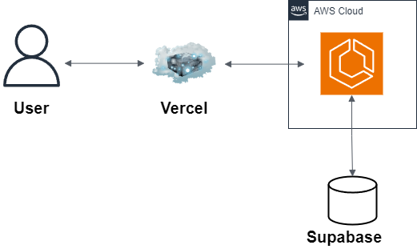

# Next.js + Echo + Redis Pub/Subの予約通知(フロントエンド用)

予約情報を追加、通知をリアルタイムで送りたい。
更にバックエンドAPIをスケーリングする方向で進める。

## Tech(Frontend)

-   Next.js
-   TypeScript
-   TailWindCSS
-   WebSocket
-   Vercel

## Tech(Other)

-   Backend
    -   Echo
    -   Go
    -   WebSocket
    -   Redis Pub/Sub
-   DB
    -   Supabase
-   Container
    -   Docker
    -   Docker Compose
-   Cloud
    -   AWS
        -   VPC
        -   ACM
        -   Route53
        -   ALB
        -   ECS
        -   ECR
        -   ElastiCache(Redis Pub/Sub)
        -   CloudWatch
        -   NAT Gateway
        -   Internet Gateway
        -   Secret Manager

## Architecture

## URL

[vercel.com](https://vercel.com/)
